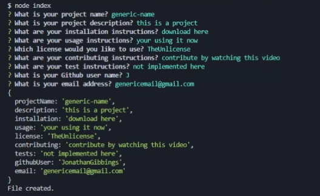

# README-Generator

## Description

An application that runs on the command line and generates a README.md based off of the user's input.

## Installation

1. Download the files
2. Run 'npm install inquirer@8.2.4' from the command line in the folder you have the index.js file in.

## Usage

Run the application from the command line in the folder index.js is in. Run it with the command node index.js.

## Screenshot

## Tutorial Video

[Tutorial Video](./assets/imgs/README-generator-tutorial.mp4)

## Built With

- JavaScript
- NodeJS
- Inquirer

## Questions

If you have any questions, please contact us at [GitHub/JonathanGibbings](https://github.com/JonathanGibbings/).
